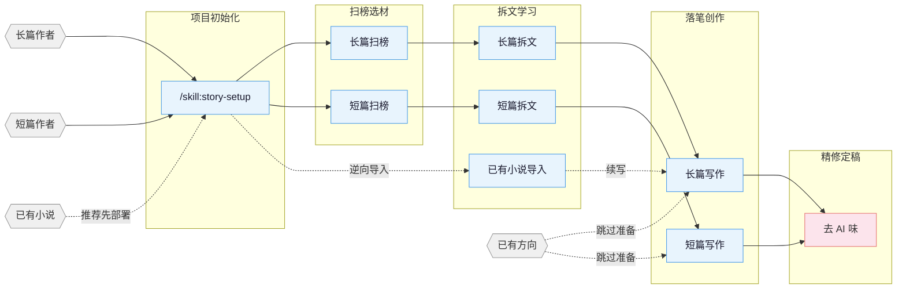

# oh-story-pi

网文写作工具箱（pi 专属版），覆盖长篇与短篇网络小说的扫榜、拆文、写作、去AI味、封面图全流程。13 个 skills + 7 个 pi-subagents 专业子代理 + 本地写作工作台，通过 pi 包分发。

## 核心思路

> **套路 = 确定性的情绪满足**

专业作者的方法论三步走：

1. **扫榜**：分析热门榜单，洞察题材、人设、切入点。
2. **拆文**：拆解大纲节奏与剧情素材，建立个人模块库。
3. **商业化写作**：学习并运用钩子、爽感、期待感等核心技巧。

围绕四条线展开：爆款逆向 · 剧情模块化重组 · 上下文状态分层管理 · 人机协同。

## 安装

### git 安装（当前唯一发布通道）

```bash
pi install git:github.com/cttailearn/oh-story-pi@v1.2.2
```

更新 / 卸载：

```bash
pi update --extensions                                   # 更新全部包（含 oh-story-pi）
pi install git:github.com/cttailearn/oh-story-pi@新ref   # 升级到新版本（改 ref 即可）
pi remove git:github.com/cttailearn/oh-story-pi           # 卸载
```

### 部署专业子代理（多 agent 协作）

7 个专业 agent（story-architect、narrative-writer、consistency-checker 等）由
`/skill:story-setup` 写入写作项目 `.pi/agents/`；pi 在新会话启动时注册项目 subagents。
判断是否生效：新会话里跑 `/skill:story-review`，报告头是 `Effective Mode: full/lean`
即注册成功，是 `Fallback: ... -> solo` 说明当前运行时未暴露该 agent（检查是否安装
pi-subagents：`pi install npm:pi-subagents`）。

**导入续写顺序：** 推荐先在写作项目根运行 `/skill:story-setup`（部署子代理、合并
AGENTS.md、建书目录），新开/刷新会话后运行 `/skill:story-import` 导入已有小说，再用
`/skill:story-long-write 日更` 或 `/skill:story-long-write 写第N章` 续写。也可以直接
运行 `/skill:story-import`；它会先检测是否已 setup，未部署时让你选择先去 setup 或
继续串行导入。

## 流程总览



## Skills

| Skill | 触发 | 说明 |
| :------ | :----- | :----- |
| `story-setup` | `/skill:story-setup` `/准备写书` | pi 项目初始化 · 子代理部署、AGENTS.md 合并、书目录创建 |
| `story` | `/story` `/skill:story` `/story dashboard` | 工具箱路由 · 模糊意图分发 + 本地拆文/项目 Dashboard |
| `story-long-write` | `/skill:story-long-write` `/写长篇` | 长篇写作 · 大纲搭建、人物设定、正文输出 |
| `story-long-analyze` | `/skill:story-long-analyze` | 长篇拆文 · 黄金三章、爽点设计、节奏分析 |
| `story-long-scan` | `/skill:story-long-scan` | 长篇扫榜 · 起点/番茄/晋江市场趋势 |
| `story-short-write` | `/skill:story-short-write` | 短篇写作 · 情绪设计、反转构思、精修出稿 |
| `story-short-analyze` | `/skill:story-short-analyze` | 短篇拆文 · 故事核、结构分析、情感线、反转设计、写作手法、共鸣分析 |
| `story-short-scan` | `/skill:story-short-scan` | 短篇扫榜 · 知乎盐言/番茄短篇风口数据 |
| `story-deslop` | `/skill:story-deslop` `/去AI味` | 去AI味 · 检测并清除 AI 写作痕迹 |
| `story-import` | `/skill:story-import` `/导入小说` | 逆向导入 · 将已有小说反向解析为标准项目结构 |
| `story-review` | `/skill:story-review` `/审查` | 多视角审查 · 4 Agent 多视角审稿 + 番茄/起点/知乎评分标准 |
| `story-image` | `/skill:story-image` `/封面` `/人物图` `/三视图` `/场景图` | 图像生成 · 封面/人设立绘/三视图/场景图，多后端（GPT-Image-2/火山方舟/通义万相/ComfyUI） |
| `browser-cdp` | `/skill:browser-cdp` | 浏览器操控 · CDP 协议复用登录态抓取数据（pi 内置 agent_browser 优先） |

> `story-deslop` 的本地检查是写作 lint：blocking 只限确定性句式/标点问题，其他提示按读感判断；朱雀等外部检测只作自测参考，不替代人工读感。

自然语言同样触发（skill 描述自动匹配）：

- 「帮我开书」→ `story-long-write`
- 「这篇太 AI 了」→ `story-deslop`
- 「把我的书导进来」→ `story-import`
- 「打开工作台」→ `story dashboard`（本机浏览拆文库与写作项目，可轻量编辑）
- 「沈栀现在什么状态」→ 自动 spawn `story-explorer` 子代理

### Story Dashboard

运行 `/story dashboard` 打开本地写作工作台，浏览拆文库与长/短篇项目文件树，并完成
搜索、Markdown 预览、文本编辑、冲突保护保存和确认删除。服务仅监听 `127.0.0.1`，
小说内容不会上传。

## Agent 体系（pi-subagents）

7 个专业子代理由 `story-setup` 部署到项目 `.pi/agents/`（pi-subagents 格式）：

| Agent | 职责 | 调用方 |
| :------ | :----- | :------- |
| `story-architect` | 题材定位、世界观构建、大纲排布、反转工程 | 长篇/短篇写作 Phase 1-3 |
| `character-designer` | 角色档案、语言风格档案、动机链、对话 | 长篇/短篇写作 |
| `narrative-writer` | 正文写作、情绪弧线执行、去AI味 7 Gate | 长篇 Phase 4-5 / 短篇 Phase 3-4 |
| `consistency-checker` | 事实一致性、伏笔断线、角色属性冲突（只读） | 写作 Phase 5 / 审查 |
| `chapter-extractor` | 章节摘要与情节点提取（只读，并行） | 长篇拆文 Stage 2 |
| `story-explorer` | 项目结构化查询：角色/伏笔/进度（只读） | 日更上下文加载 / 审查 / 路由 |
| `story-researcher` | 资料研究，带来源引用的参考文件 | 写作资料研究 / 审查事实核查 |

- 模型分工（随模板部署，opencode-go 提供商）：只读高频 agent（story-explorer /
  chapter-extractor / consistency-checker）钉 `opencode-go/deepseek-v4-flash`，创作推理
  agent（story-architect / character-designer / narrative-writer / story-researcher）钉
  `opencode-go/deepseek-v4-pro`；想换模型时在 `~/.pi/agent/settings.json` 的
  `subagents.agentOverrides` 里按 name 指定。
- 子代理不可用（未部署/未装 pi-subagents/运行时未暴露）时，相关 skill 自动降级
  solo/direct 并报告 `Fallback: ... -> solo`，写作流程不中断。

## 写正文守卫

pi 无 hooks 机制，原多端版的运行时硬拦截由两层等价物承担：

- **skill 内检查点**：日更/回炉 workflow 强制 `tracking_commit.py check`（追踪状态
  缺失/不一致即停止，fail-closed）、细纲边界检查、去AI味确定性脚本检查。
- **确定性脚本**：`check-ai-patterns.js`（blocking 句式/标点）、`check-degeneration.js`
  （退化检测）、`normalize-punctuation.js`（标点规范化），写作 skill 在写后自检阶段调用。

## 项目文件结构

```text
项目根/
├── AGENTS.md                 ← story-setup 合并写入（路由表 + 约定）
├── .pi/
│   ├── agents/               ← 7 个专业子代理（pi-subagents 格式）
│   └── settings.json         ← 可选：pi install -l 项目级包安装
├── .active-book              ← 当前活跃书目
├── .story-deployed           ← 部署标记（agents_version / target_cli: pi）
├── 拆文库/{书名}/            ← 拆文分析结果（数据源）
├── 对标/{书名}/              ← 对标引用视图
└── {书名}/                   ← 长篇项目（含 追踪/ 或 设定/ 子目录）
    ├── 正文/                 ← 正文章节
    ├── 大纲/                 ← 卷纲、细纲
    ├── 设定/                 ← 角色、世界观、题材定位
    └── 追踪/                 ← _tracking-state.json 唯一结构化权威 + 派生视图
```

短篇项目为单文件结构：`{短篇标题}/正文.md` + `小节大纲.md` + `设定.md`。

## 知识体系

`story-setup/references/agent-references/` 是 600KB+ 的共享写作知识库（题材卡、爽点
钩子、人设方法、对话掌控、情绪曲线、去AI味语料等），由写作/审查 skill 与子代理按需
加载。skill 本体与知识库随 pi 包更新（`pi update --extensions`），项目内不复制副本。

## 适用平台

- **pi**：原生支持（本包）。`pi install git:github.com/cttailearn/oh-story-pi@v1.2.2` 后 13 个 skill 自动可用，
  `/story` 命令别名由包内扩展注册。npm 发布因账号 2FA 策略暂缓，待条件允许后补充（包名 `oh-story-pi` 已预留）。
- 旧多端版（Claude Code / OpenCode / Codex / ZCode / OpenClaw / Reasonix）见上游仓库
  [oh-story-claudecode](https://github.com/worldwonderer/oh-story-claudecode) 的 v0.7.5
  及更早版本；本仓库 v1.0.0 起为 pi 专属，不再维护其它 CLI 适配。

## 贡献

见 [CONTRIBUTING.md](CONTRIBUTING.md)。改动 skill 正文后跑 `python scripts/static-check.py`
与 `python scripts/check-current-skill-contracts.py`，两个都必须零失败。

## 交流

- 问题与建议：GitHub Issues
- 变更日志：[CHANGELOG.md](CHANGELOG.md)

## 致谢

上游项目 [oh-story-claudecode](https://github.com/worldwonderer/oh-story-claudecode)（worldwonderer）。
