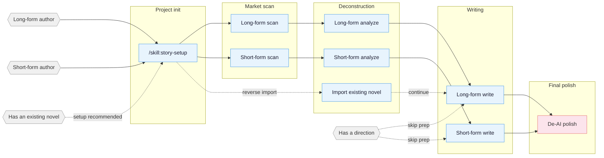

# oh-story

Web-novel writing toolkit (**dual-runtime: pi / dsh**) covering the full pipeline for
long-form and short-form Chinese web fiction: market scanning, deconstruction,
writing, review, de-AI polish, and cover/character-sheet image generation.
13 skills + 7 professional subagents + a local writing dashboard,
distributed as a pi package and a dsh skill root.

## Core idea

> **Formula = deterministic emotional payoff**

A three-step professional-author workflow:

1. **Scan rankings** — analyze hot charts to spot trending genres, character
   archetypes, and entry points.
2. **Deconstruct** — reverse-engineer outlines, pacing, and plot material to
   build your personal module library.
3. **Write commercially** — apply hooks, gratification, and anticipation
   techniques.

Four guiding threads: reverse-engineering bestsellers · modular plot recomposition ·
layered context-state management · human-AI collaboration.

## Install

### pi channel (git)

```bash
pi install git:github.com/cttailearn/oh-story@v2.3.0
```

Update / uninstall:

```bash
pi update --extensions                                # update all packages (incl. oh-story)
pi install git:github.com/cttailearn/oh-story@new-ref   # upgrade to a new ref
pi remove git:github.com/cttailearn/oh-story        # uninstall
```

### dsh channel (DeepSeek Harness)

```powershell
# Install from GitHub (pinned release tag, recommended)
dsh plugin --profile web add github:cttailearn/oh-story#v2.3.0

# Or install the latest main-branch content (dev build)
dsh plugin --profile web add github:cttailearn/oh-story
```

After installing, **append the mount row once** to `~/.dsh/cordis.patch.yml` (home level,
applies to every profile) so the skill registry discovers the in-package skills
(dsh plugin activation is explicit: install ≠ activate; the mount row is a one-time step):

```yaml
- insert:
    - id: oh-story-skills
      name: '@deepseek-ai/dsh-skill-filesystem'
      config:
        providerName: oh-story
        includeDefaultRoots: false
        customSkillDirs:
          - !!js process.getBuiltinModule('node:url').fileURLToPath(new URL('node_modules/oh-story/skills/', baseUrl))
```

Update / uninstall (same style as pi):

```powershell
dsh plugin --profile web add github:cttailearn/oh-story#new-tag   # upgrade (change the ref)
dsh plugin --profile web remove oh-story                        # uninstall
# After uninstall: delete the mount row above; remove any leftover node_modules/oh-story directory
```

> **Local development**: `dsh plugin --profile web add link:<local clone path>` (`link:` creates a
> junction to the repo; `git pull` updates it without reinstalling).
> **Note**: the web profile disables HMR, so **restart the dsh session** after install/update;
> then typing `/story` (or natural language "我想写小说") should trigger — all 13 skills visible
> means success. Saying "检查更新" in a session compares the GitHub version with local
> `skills/story/VERSION`.

### Deploy professional subagents (multi-agent collaboration)

The 7 professional agents (story-architect, narrative-writer, consistency-checker,
etc.) are deployed by `/skill:story-setup` (dsh: `/story-setup`) per runtime:

- **pi**: written into the writing project's `.pi/agents/` (pi-subagents format,
  discovered live at spawn time).
- **dsh**: written into `.dsh/story-agents/` as subagent prompt templates (dsh has no
  file-based agent registry; writing/review skills spawn via the `subagent` tool using
  the template; tool mapping fffind→glob, ffgrep→grep).

To verify activation, run `/skill:story-review` (pi) or `/story-review` (dsh) — the
report header shows `Effective Mode: full/lean` when registration succeeded, or
`Fallback: ... -> solo` when agents are unavailable (pi: check
`pi install npm:pi-subagents`; dsh: check `.dsh/story-agents/`).

**Import-then-continue order:** run `/skill:story-setup` first in the project root
(dsh: `/story-setup`; deploys agents, merges AGENTS.md, creates the book directory),
then (refresh or) start a new session and run `/skill:story-import` (dsh:
`/story-import`) to import an existing novel, then
`/skill:story-long-write 日更` (dsh: `/story-long-write 日更`) to continue
writing. The import skill can also run standalone — it detects whether setup
was done and lets you choose between setting up first or continuing serially.

## Workflow overview



## Skills

| Skill | Trigger | Description |
| :------ | :----- | :----- |
| `story-setup` | `/skill:story-setup` `/准备写书` | Project init · subagent deployment, AGENTS.md merge, book directory creation |
| `story` | `/story` `/skill:story` `/story dashboard` | Toolbox router · fuzzy-intent dispatch + local deconstruction/writing Dashboard |
| `story-long-write` | `/skill:story-long-write` `/写长篇` | Long-form writing · outline, character design, chapter output |
| `story-long-analyze` | `/skill:story-long-analyze` | Long-form deconstruction · golden three chapters, gratification design, pacing analysis |
| `story-long-scan` | `/skill:story-long-scan` | Long-form market scan · Qidian/Fanqie/Jinjiang trends |
| `story-short-write` | `/skill:story-short-write` | Short-form writing · emotion design, twist drafting, polish |
| `story-short-analyze` | `/skill:story-short-analyze` | Short-form deconstruction · story core, structure, emotion line, twists, technique, resonance |
| `story-short-scan` | `/skill:story-short-scan` | Short-form market scan · Zhihu Yanxuan/Fanqie trending data |
| `story-deslop` | `/skill:story-deslop` `/去AI味` | De-AI polish · detect and remove AI writing traces |
| `story-import` | `/skill:story-import` `/导入小说` | Reverse import · parse an existing novel into the standard project layout |
| `story-review` | `/skill:story-review` `/审查` | Multi-perspective review · 4-agent review + Fanqie/Qidian/Zhihu scoring rubrics |
| `story-image` | `/skill:story-image` `/封面` `/角色卡图` `/人物图` `/三视图` `/场景图` | Image generation · covers/character sheets (unified portraits + three-view reference tables)/scenes, multiple backends (GPT-Image-2/GrsAI/Volcengine/DashScope/ComfyUI), asks for API keys when unconfigured  + **custom image API onboarding** (docs + key → auto-generated script, tested) |
| `browser-cdp` | `/skill:browser-cdp` | Browser automation · CDP protocol reusing logged-in sessions (pi's built-in agent_browser takes priority) |

> `story-deslop`'s local check is a writing lint: `blocking` findings are limited to
> deterministic phrasing/punctuation issues; everything else is judged by reading
> feel. External detectors (e.g. Zhuque) are self-test references only.

Natural-language triggers work too (skill descriptions auto-match):

- 「帮我开书」(help me start a book) → `story-long-write`
- 「这篇太 AI 了」(this reads too AI) → `story-deslop`
- 「把我的书导进来」(import my book) → `story-import`
- 「打开工作台」(open the dashboard) → `story dashboard`
- Asking about a character's state → spawns the `story-explorer` subagent

### Example output

Character-sheet images are generated by `story-image` from the character card —
unified portrait, three-view, and reference table layout (info panel / expression
grid / outfit breakdown / palette), bilingual prompts:


> Real API generation (1024x1536), full pipeline: character card →
> character-card.py extraction → prompt-template.py assembly → imagegen.sh.

### Story Dashboard

Run `/story dashboard` to open the local writing dashboard: browse the
deconstruction library and long/short-form project file trees with search,
Markdown preview, text editing, conflict-protected saving, and confirm-before-delete.
The server listens on `127.0.0.1` only — novel content never leaves your machine.

## Agent system (pi-subagents / dsh prompt templates)

7 professional subagents deployed to the project's `.pi/agents/` by `story-setup`
(pi-subagents format):

| Agent | Responsibility | Called by |
| :------ | :----- | :------- |
| `story-architect` | Genre positioning, worldbuilding, outline layout, twist engineering | Long/short-form writing Phase 1-3 |
| `character-designer` | Character profiles, speech-style files, motivation chains, dialogue | Long/short-form writing |
| `narrative-writer` | Prose writing, emotion-arc execution, de-AI 7-gate | Long-form Phase 4-5 / short-form Phase 3-4 |
| `consistency-checker` | Fact consistency, dropped foreshadowing, character-attribute conflicts (read-only) | Writing Phase 5 / review |
| `chapter-extractor` | Chapter summaries and plot-point extraction (read-only, parallel) | Long-form deconstruction Stage 2 |
| `story-explorer` | Structured project queries: characters/foreshadowing/progress (read-only) | Daily-update context loading / review / routing |
| `story-researcher` | Background research with source-cited reference files | Writing research / review fact-checking |

- **Model split** (deployed with templates, opencode-go provider): read-only
  high-frequency agents (story-explorer / chapter-extractor / consistency-checker)
  are pinned to `opencode-go/deepseek-v4-flash`; creative agents (story-architect /
  character-designer / narrative-writer / story-researcher) are pinned to
  `opencode-go/deepseek-v4-pro`. To change models, set `subagents.agentOverrides`
  in `~/.pi/agent/settings.json` by name.
- When subagents are unavailable (not deployed / pi-subagents missing / not exposed
  by the runtime), the affected skills degrade to solo/direct mode automatically
  and report `Fallback: ... -> solo` — writing flows never break.

## Writing guards

pi has no hooks mechanism; the old multi-CLI runtime hard-intercepts are covered
by two equivalent layers:

- **In-skill checkpoints**: daily-update/rewrite workflows force
  `tracking_commit.py check` (missing/inconsistent tracking state stops the flow,
  fail-closed), outline-boundary checks, and deterministic de-AI script checks.
- **Deterministic scripts**: `check-ai-patterns.js` (blocking phrasing/punctuation),
  `check-degeneration.js` (degeneration detection), `normalize-punctuation.js`
  (punctuation normalization) — run in the post-write self-check phase.

## Project layout

```text
project root/
├── AGENTS.md                 ← merged by story-setup (routing table + conventions)
├── .pi/
│   ├── agents/               ← 7 professional subagents (pi-subagents format)
│   └── settings.json         ← optional: project-level package install
├── .active-book              ← currently active book
├── .story-deployed           ← deployment sentinel (agents_version / target_cli: pi)
├── 拆文库/{书名}/            ← deconstruction results (data source)
├── 对标/{书名}/              ← benchmarking reference views
└── {书名}/                   ← long-form project (with 追踪/ or 设定/ subdirs)
    ├── 正文/                 ← chapters
    ├── 大纲/                 ← volume/beat outlines
    ├── 设定/                 ← characters, worldbuilding, genre positioning
    └── 追踪/                 ← _tracking-state.json (single structured authority) + derived views
```

Short-form projects are single-file: `{title}/正文.md` + `小节大纲.md` + `设定.md`.

## Knowledge base

`story-setup/references/agent-references/` is a 500KB+ shared writing knowledge
base (genre cards, gratification hooks, character methods, dialogue control,
emotion curves, de-AI corpora) loaded on demand by writing/review skills and
subagents. Skill bodies and the knowledge base ship with the pi package
(`pi update --extensions`); projects do not keep local copies.

## Platforms

- **pi**: first-class. `pi install git:github.com/cttailearn/oh-story@v2.3.0` makes all 13 skills
  available; the `/story` command alias comes from the in-package extension; agents deploy to
  `.pi/agents/`. npm publishing is deferred due to account 2FA policy (the `oh-story` name is reserved).
- **dsh (DeepSeek Harness)**: first-class. `dsh plugin --profile web add github:cttailearn/oh-story#v2.3.0` + one mount row (see the install section) and the 13 skills are
  discovered from the home-level skill root (project-level placement also works); trigger via
  `/story`, `/story-*` or natural language; agent prompt templates deploy to `.dsh/story-agents/`.
  dsh auto-loads the project `AGENTS.md`, so the routing table takes effect directly.
- Legacy multi-CLI editions (Claude Code / OpenCode / Codex / ZCode / OpenClaw / Reasonix) live in
  the upstream repo [oh-story-claudecode](https://github.com/worldwonderer/oh-story-claudecode)
  up to v0.7.5; this repo is pi-exclusive from v1.0.0 and **dual-runtime (pi / dsh) since v2.0.0**.

## Contributing

See [CONTRIBUTING.md](CONTRIBUTING.md). After changing skill bodies, run
`python scripts/static-check.py` and
`python scripts/check-current-skill-contracts.py` — both must pass with zero
failures.

## Feedback

- Issues & suggestions: GitHub Issues
- Changelog: [CHANGELOG.md](CHANGELOG.md)

## Credits

Upstream project [oh-story-claudecode](https://github.com/worldwonderer/oh-story-claudecode) (worldwonderer).
